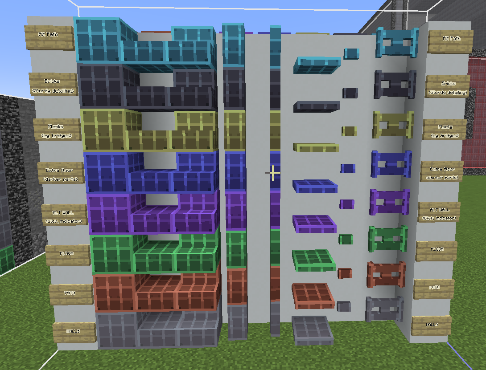

## Processor Blocks
Name is `processor_block_1`, the more specific ones have a suffix like: `processor_block_1_slab`.

| Color  | ID   | Name                | Use        |
|--------|------|---------------------|------------|
| Grey   | 1    | `processor_block_1` | Walls      |
| Orange | 2    | `processor_block_2` | Paths      |
| Green  | 3    | `processor_block_3` | Floors     |
| Purple | 4    | `processor_block_4` | Alt Wall   |
| Blue   | 5    | `processor_block_5` | Dark Floor |
| Yellow | 6    | `processor_block_6` | Planks     |
| Black  | 7    | `processor_block_7` | Bricks     |
| L_Blue | 8    | `processor_block_8` | Alt Path   |

Where walls, paths and floors comprise the bulk of the room. 

Alt wall can be used for etching, and indicators like cracks.
Dark floor can be used in corners, further away from the path.
Planks will (almost) always be planks, for things like bridges.
Bricks can be used to indicate a more solid part.

Use these when making builds, both rooms and POIs, so the processors can easily target them.

Water can be used in the build as the themed liquid.

The other processor blocks can be used, but require a custom processor from the builder, and will be room specific, eg. a tree always needing logs. 

## Room Sizes
The size of a room is indicated with a multiple of the gridlenght, being 15. The number between brackets indicates the fixed multiplier, in X, Y and Z direction, respectively.  

Stable (3x3x3), standard room near the start, 47 blocks in every direction, and all doors easely reachable.  
Unstable (3xYx3), doors are not easely reachable anymore, and is used as a step between Stable and Chaos).  
Chaos (XxYxZ), doors are not in the center of a face anymore, has varying sizes, and makes the generated rift maze-like.  

## Room Builds
All edges of the rooms need to be at least 3 blocks thick. This is not a hard rule, but try to have >90% of the walls 3 blocks thick  
Leave spaces for POIs, which will be randomly generated on set positions. A jigsaw block needs to be placed in the center of the POI location.

Chaos rooms need 1/3 of their doors to remain open, with the jigsaw blocks inside them. Those doors need to be scattered around the room. The other doorways can be covered by processor blocks, but not by bedrock.

## Room Naming
The created room has to be saved using the following structure:  
`wotr:rift/room/stability/XYZ/roomname_x_signature` ,  
Where Stability is Stable, Unstable or Chaos, XYZ is the size in every direction (1, 2 or 3), and roomname is the name of the room, chosen by the builder, x is the variation number, signature is the builders signature.  
Example: `wotr:rift/room/stable/333/testRoom_1_builderName`.

## POI sizes
The POI sizes will be (X, Y, Z):  
(3, 3, 3)\*, (5, 5, 5), (7, 6, 7), (9, 8, 9), (11, 9, 11)\*.  
This is the outer size of the POI, not counting the floor layer.  
*Up for debate, might very well be removed.

## POI naming
To be decided
